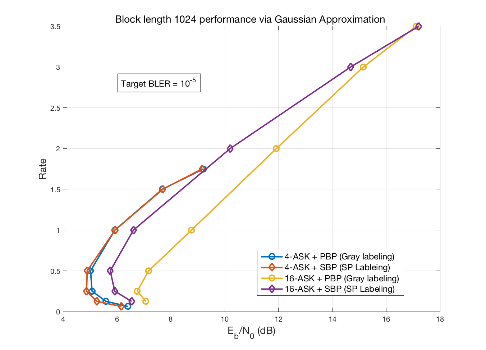
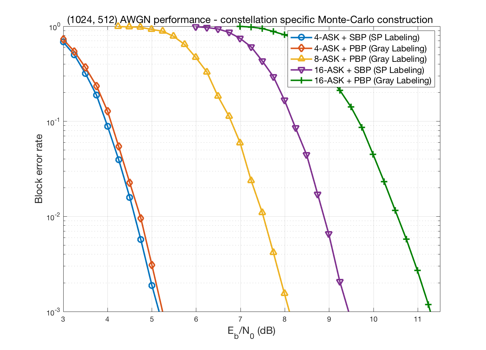

Polar codes 
===================

This repository provides C and MATLAB implementations for polar codes.

> For the seminal work on polar codes, please refer to: **Erdal Arikan**, "Channel polarization: A method for constructing capacity-achieving codes for symmetric binary-input memoryless channels",  http://arxiv.org/abs/0807.3917 

Overview of what is provided
----------

 - Encoding for polar codes

 - Decoding for polar codes including
	 - Successive cancellation (SC) decoding (See [Arikan](http://arxiv.org/abs/0807.3917))
	 - Successive cancellation list (SCL) decoding (See [Tal](https://arxiv.org/abs/1206.0050))
	 - LLR based SCL decoding (See [Stimming](https://arxiv.org/abs/1401.3753))
	 
 - Code construction: 
 	 - Bhattacharya parameter based construction 
	 - Monte Carlo code construction (BPSK, 4-ASK, 8-ASK, 16-ASK) 
	 	- PolarM only (Update Nov, 2016)
	 - Gaussian Approximation code construction (BPSK, 4-ASK, 8-ASK, 16-ASK) 
	 	- PolarM only (Update Nov, 2016)

 - AWGN simulations
 	- Support for BPSK
	- Support for 4-ASK, 8-ASK, 16-ASK 
		- Both Bit interleaved coded modulation (BICM) and multi-level coding (MLC) approaches are supported
		- See [Mathis](https://opus4.kobv.de/opus4-fau/files/6201/MathisSeidlDissertation.pdf) for a summary of these approaches.
		- PolarM only (Update Nov, 2016)
		- Note the List decoder is not supported for MLC approaches in the current version
	

Decoding performance
------

The figure above shows the performance comparison between PolarC and [Tal](https://arxiv.org/abs/1206.0050) Fig. 1. A close comparison reveals that the performance for CRC aided polar code is about 0.1 dB worse. Note that the two key differences are (i) code construction method (ii) LLR based decoder with hardware-friendly (see [Stimming](https://arxiv.org/abs/1401.3753)) LLR updates for large values of LLRs. 

** Update Nov, 2016 ** 

The figure above shows the results for modulation specific polar codes using the Gaussian approximation code construction for block length 1024 across a variety of rates and constellations. The results are close to the results given in [Mathis](https://opus4.kobv.de/opus4-fau/files/6201/MathisSeidlDissertation.pdf). 

The figure above shows the results for  for modulation specific polar codes  using the Monte Carlo code construction for block length 1024 and info length 512 codes. The results use link level simulations for AWGN channel using the SCD algorithm. The results for 4-ASK + PBP (Gray Labeling) are close to the results in [Mahdavifar](https://arxiv.org/pdf/1302.0265v1.pdf) though there are some differences in the approach itself. 

Runtime performance C and MATLAB
-----
Runtime is mainly dominated by the decoder. The run time comparison for rate 1/2 code is as follows (run on a single macbook pro 2015):
<table>
<caption> Comparison of number of iterations per second </caption>
  <tr align="center">
    <th>Parameters </th>
    <th>PolarC </th>
    <th>PolarM</th>
	<th>Speedup C/M</th>
  </tr>
  <tr align="center">
    <td>N = 2048, L = 1</td>
    <td>250</td>
    <td>51 </td>
    <td>5x</td>
  </tr>
  <tr align="center">
    <td>N = 2048, L = 4</td>
    <td>67 </td>
    <td>3.2</td>
    <td>20x</td>
  </tr>
  <tr align="center">
    <td>N = 2048, L = 32</td>
    <td>10.1</td>
    <td>0.65</td>
    <td>15x</td>
  </tr>
  <tr align="center">
    <td>N = 512, L = 1</td>
    <td>890</td>
    <td>204</td>
    <td>4.5x</td>
  </tr>
  <tr align="center">
    <td>N = 512, L = 4</td>
    <td>287</td>
    <td>14</td>
    <td>20x</td>
  </tr>
  <tr align="center">
    <td>N = 512, L = 32</td>
    <td>44</td>
    <td>2.8</td>
    <td>16x</td>
  </tr>
</table>

Code Interface
------

The key code is in class PolarCode (C and MATLAB). The interface to this class is as follows:

 - **constructor**
	 - Input: N or n, K, epsilon, CRC 
	 - Output: None 
	 - Function: create polar code with specified parameters. 
		 - Bhattacharya parameter based construction is used.

 - **encode** (MATLAB code modified from [Pfister](http://pfister.ee.duke.edu/courses/ecen655/polar.pdf))
	 - Inputs: info bits (length = K)
	 - Output: coded bits (length = N)

 - **decode_SC_P1** (only for MATLAB - code modified from [Pfister](http://pfister.ee.duke.edu/courses/ecen655/polar.pdf))
	 - Input: vector of probability of a bit being  '1' (length = N)
	 - Output: decoded info bits (length = K)
	 - Function: SC decoder  (see [Arikan](http://arxiv.org/abs/0807.3917))

 - **decode_SCL_P1**
	 - Input: p1, p0, L 
		 - p1 = vector of probability of output given bit = 1, 
		 - p0 = vector of probability of output given bit = 0,   
		 - L = list size
	 - Output: decoded info bits
	 - 	Function: SCL decoder (see [Tal](https://arxiv.org/abs/1206.0050))

 - **decode_SCL_LLR**
	 - Input: LLR, L
		 - LLR = vector of log likelihood ratios 
		 - L = list size
	 - Output: decoded info bits
	 - Function: LLR based SCL decoder (see [Stimming](https://arxiv.org/abs/1401.3753))

 - **get_bler_quick** (helper function)
	 - Input: EbNo_vec, list_size_vec
	 - Output: BLER estimate
	 - Function: get BLER estimate. 
		 
> Note that for speed up of simulation, get_bler_quick assumes that if a given run (as in info bit and noise realizations) is decoded for a lower EbNo value, then it will be decoded for a higher EbNo value. 

Bugs and support
------

The PolarC code will not compile with libstdc++. The code only works with libc++.

The code is provided as is without any warranty (implicit or explicit) and without guarantee of correctness. 

References
---------

 1. **E. Arikan**, "Channel polarization: A method for constructing capacity-achieving codes for symmetric binary-input memoryless channels", [http://arxiv.org/abs/0807.3917](http://arxiv.org/abs/0807.3917) 
 2.  **Ido Tal** and **Alexander Vardy**, 	"List Decoding of Polar Codes", [https://arxiv.org/abs/1206.0050](https://arxiv.org/abs/1206.0050)
 3.  **Alexios Balatsoukas-Stimming**, **Mani Bastani Parizi**, **Andreas Burg**, "LLR-based Successive Cancellation List Decoding of Polar Codes", [https://arxiv.org/abs/1401.3753](https://arxiv.org/abs/1401.3753)
 4. **Henry D. Pfister,** "A Brief Introduction to Polar Codes", [http://pfister.ee.duke.edu/courses/ecen655/polar.pdf]( http://pfister.ee.duke.edu/courses/ecen655/polar.pdf)
 5. **Mathis Seidl**, Polar Coding: Finite-Length Aspects, [Phd Thesis](https://opus4.kobv.de/opus4-fau/files/6201/MathisSeidlDissertation.pdf)
 6. **Hessam Mahdavifar**, **Mostafa El-Khamy**, **Jungwon Lee** and  **Inyup Kang**, Compound Polar Codes, [https://arxiv.org/pdf/1302.0265v1.pdf](https://arxiv.org/pdf/1302.0265v1.pdf)

